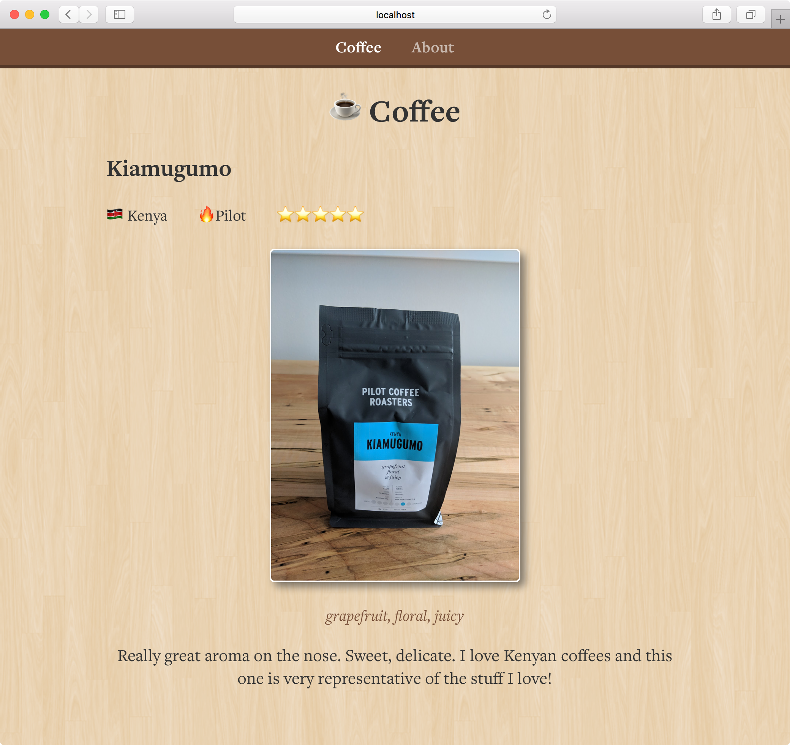

# hello-coffee

[](https://app.codeship.com/projects/329360)

Proof of Concept app by [Tinacious Design](https://tinaciousdesign.com) to test out Vue.js and Contentful.




## Project setup
```
yarn install
```

### Compiles and hot-reloads for development
```
yarn run serve
```

### Compiles and minifies for production
```
yarn run build
```

### Run your tests
```
yarn run test
```

### Lints and fixes files
```
yarn run lint
```

### Run your unit tests
```
yarn run test:unit
```

### Customize configuration
See [Configuration Reference](https://cli.vuejs.org/config/).
